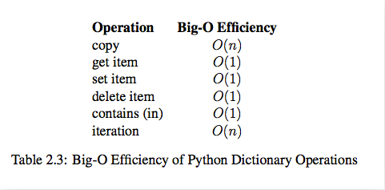

# python-algorithm

## 程序 = 数据结构 + 算法

- 算法: 为了解决实际问题而设计
- 数据结构: 算法需要处理的问题载体
    + 抽象数据类型(Abstract Data Type)，数据类型和其上的运算捆在一起，进行封装（类）
    + Python内置的常用数据结构（非基础数据类型：int,float,str）：tuple, list, dict, set
    + 常用的数据运算: 插入, 删除, 修改, 查找, 排序

## 算法效率衡量

### 时间复杂度

> 程序的运行的计算机环境会影响程序运行的速度并反应在程序的执行时间上,
> 假定计算机执行一个基本操作的时间是固定的(一个时间单位),
> 则可忽略机器环境的影响，用程序运行的基本操作数量客观的反应算法的时间效率,
> （有多少个基本操作就代表会花费多少时间单位）

1. 算法A处理规模为n的问题:
    + 统计基本操作数量 => 时间规模函数`T(n)` 
    + 将时间规模函数`T(n)`简化为一个数量级（忽略常数因子）=> 数量级函数`g(n)` => 渐进时间复杂度,大O记法：`O(g(n))`（简称时间复杂度）
    + 注：在没有特殊说明时，分析的算法的时间复杂度都是指`最坏时间复杂度`

2. `T(n`统计规则：
    + 顺序结构 => 加法
    + 循环结构 => 乘法
    + 分支结构 => 取最大值

3. `T(n)` => `O(g(n))`规则：
    + 常数量级(即只有常数项),则用数1表示，eg: `T(n)=2 => g(n)=1 => O(1)`
    + 只需要关注操作数量的最高次项，其它次要项和常数项可以忽略，eg: `T(n)=5n^2+3n+2 => g(n)=n^2 => O(n^2)` 

4. 常见时间复杂度与比较:

    | T(n)           | O(n)     |
    |:---------------|:---------|
    | 12             | O(1)     |
    | 2n+3           | O(n)     |
    | 3n^2+2n+1      | O(n^2)   |
    | 5logn+20       | O(logn)  |
    | 2n+3nlogn+19   | O(nlogn) |
    | 6n^3+2n^2+3n+4 | O(n^3)   |
    | 2^n            | O(2^n)   |
    
    + O(1) < O(logn) < O(n) < O(nlogn) < O(n^2) < O(n^3) < O(2^n) < O(n!) < O(n^n)
    

### python性能分析工具

`timeit`模块的`Timer`类:

- 测量小段代码的执行速度
- 创建：`class timeit.Timer(stmt='pass', setup='pass', timer=<timer function>)`
    + stmt: 要测试的代码语句
    + setup: 运行代码时需要的设置；
    + timer: 一个定时器函数，与平台有关
- 测试：`.timeit(number=1000000)`
    + number: 测试次数(默认100w)
    + 返回：执行代码的平均耗时（秒数，float类型）
- Demo: [list timeit](1.list-timeit-demo.py)

**Sample:**

```python
from timeit import Timer

def test_gen1():
   l = [i for i in range(1000)]

if __name__=='__main__':

    # class timeit.Timer(stmt='pass', setup='pass', timer=<timer function>)
    # timeit.Timer.timeit(number=1000000)

    t1=Timer("test_gen1()","from __main__ import test_gen1")
    r1=t1.timeit(number=1000)
    print("test_gen1 : [i for i in range(...)]   => cost: %.5fs" % r1)
    # Run Result:
    # test_gen1 : [i for i in range(...)]   => cost: 0.04163s
```


### python内置数据类型操作的时间复杂度

- `list`
    
    

- `dict`
    
    


## 存储方式

- 顺序存储：元素顺序地存放在一块连续的存储空间中 => 连续
- 链式存储：元素存放在通过链接构造起来的一系列存储空间中 => 离散


### 顺序存储


- 存储结构: 
    + 表头区：存储容量，已使用量等信息
    + 数据区：存储实际数据元素或元素的地址信息（即链接，指向实际存储的数据元素）
    + 一体式结构
        * 表头区与数据区在一块连续的存储区
        * 满了，再添加元素时，整体搬迁（整个地址变了）
    + 分离式结构
        * 表头区与数据区在二块存储区，通过链接关联
        * 满了，再添加元素时，数据区搬迁，表头区修改链接指向新的地址
- 添加元素：
    + 未满时，不需要进行数据的搬迁
    + 满时，需进行扩充搬迁，每次扩充可增加固定数目或以倍数增加存储空间
- 遍历元素：基于下标（逻辑地址，表示相对于表头地址的偏移数量）遍历
- eg：`list` (python中的顺序表)
    + 存储结构: 分离式结构 + 元素外置
    + 扩充策略：4倍增，到阈值50000时，一倍增

### 链式存储


- 存储结构: 每个节点（数据区：存储具体的数据 ＋ 链接区：指向下一个节点），节点间通过链接关联起来
    + 节点们线性串联：
        * 单向链表，单向循环链表
        * 双向链表，双向循环链表
    + 节点们非线性串联：
        * 树
        * 图
- 添加元素：不需要进行数据的搬迁，可利用任意空闲的内存空间，创建一个节点，通过链接关联
- 遍历元素：基于链接关系遍历


## 数据结构（抽象数据类型）

- 列表(顺序存储结构)/链表(链式存储结构)
    + Demo: [SingleLinkList](2.link-demo.py)
- 栈/队列
    + Demo: [Stack & Queue](3.stack-queue-demo.py)
    + 可用顺序／链式存储结构
    + 栈: 先进后出
    + 队列: 先进先出
- 树
    + Demo: [Binary Tree](4.tree-demo.py)
    + 遍历：
        * 广度搜索遍历：队列(先进先出) = 层级遍历
        * 深度搜索遍历：堆栈(先进后出) = 先序遍历
        * 先序遍历：根 -> 左 -> 右
        * 中序遍历：左 -> 根 -> 右
        * 后序遍历：左 -> 右 -> 根
    + 结构: 
        * 堆：[Binary Heap](binaryHeap.py),[Binary Index Heap](binaryIndexHeap.py), d-ary Heap
        * 搜索树: [Binary Search Tree](binarySearchTree.py)
        * 平衡树：红黑树(B Tree)，2-3 Tree, AVL Tree, Splay Tree
        * 字典树：Trie Tree
        * 树堆：Treap（平衡二叉树与堆的结合）
        * 并查集：Disjoint-set(Union & Find)
- 图
    + Demo: [Graph](graph.py)
    + 点和边组成的数学模型（Vertex & Edge)
    + 分类：
        * 无向图(Undirected) & 有向图(Directed)
        * 无权图(UnWeighted) & 有权图(Weighted)
    + 存储
        * 邻接矩阵 Adjacency Matrix => 适合表示稠密图(Dense Graph)
        * 邻接表 Adjacency List => 适合表示稀疏图(Sparse Graph)
    + 遍历(Travel)：图 => 树／森林
        * DFS 深度优先遍历（递归,注意记录每个节点是否已遍历）
        * BFS 广度优先遍历（非递归,借助队列）
    + 应用：
        * 连接问题：连通 => 判断：两个节点是否连通，是否形成环；统计：区块内节点数量，统计区块数量
        * 路径问题：寻路 => 最小生成树(Minimum Span Tree), 最短路径(Shortest Path Tree)

## 算法: 排序

- 基础排序([Demo](sortBasic.py)) => 平均时间复杂度：O(N^2)
    + 选择排序 Selection Sort
    + 插入排序 Insertion Sort -> 希尔排序 Shell Sort
    + 冒泡排序 Bubble Sort

- 高级排序([Demo](sortAdvance.py)) => 平均时间复杂度：O(N*logN)
    + 归并排序 Merge Sort
    + 快速排序 Quick Sort
    + 堆排序 Heap Sort
    + 注：Merge Sort & Quick Sort本质就是一颗二叉树的深度搜索(先序／后序)

- O(N*logN) 比 O(N^2) 快多少：

    |  N   |  N^2  | N*logN  | 差倍数 |
    |:-----|:------|:--------|:------|
    | 10   | 10^2  | 33      | 3     |
    | 10^2 | 10^4  | 664     | 15    |
    | 10^3 | 10^6  | 9966    | 100   |
    | 10^4 | 10^8  | 132877  | 753   |
    | 10^5 | 10^10 | 1660964 | 6020  |

- 排序算法的稳定性：
    + 稳定排序算法会让原本有相等键值的记录维持相对次序
    + eg: `[(4, 1),(3, 1),(3, 7),(5, 6)]` 按tuple的第一个元素排序
        *  => `[(3, 1),(3, 7),(4, 1),(5, 6)]` => `(3, 1)`和`(3, 7)`维持次序 => 稳定
        *  => `[(3, 7),(3, 1),(4, 1),(5, 6)]` => `(3, 1)`和`(3, 7)`次序改变 => 不稳定

- 算法比较：

    |   Sort         | 平均时间复杂度 | 原地 | 额外空间复杂度 | 稳定 |
    |:---------------|:------------|:-----|:------------|:----|
    | Insertion Sort | O(N^2)      | Y    | O(1)        | Y   |
    | Merge Sort     | O(N*logN)   | N    | O(N+logN)   | Y   |
    | Quick Sort     | O(N*logN)   | Y    | O(logN)     | N   |
    | Heap Sort      | O(N*logN)   | Y    | O(1)        | N   |

- 其它：不基于比较的排序([Demo](6.sort-nocompare.py)) => 时间复杂度: `O(N)`,空间复杂度: `O(M)` （思想来自桶排序，M＝桶数）
    - 桶排序 bucket sort
    - 计数排序 Counting Sort
    - 基数排序 Radix Sort

- 算法选择：
    + 大量重复元素：3路快排
    + 近乎有序：插入排序
    + 取值范围有限：计数排序
    + 要稳定：归并排序
    + 链表存储：归并排序
    + 大数据，无法一次性装入内存：外排序


### 基础: 选择排序(Selection)

- `[min,...,max ^ | ...min...]`
    + 列表看成两段(`[0,j] & [j+1,n-2],i:[j+1 -> n-1]`)，前段的尾部，每轮增加下一个有序元素
    + 每轮循环，通过比较，记录最大／最小元素的索引，与后段第一个元素交换位置，作为前段尾部新元素（列表前段是排好序的）
- 时间复杂度: `O(N^2)`
- 空间复杂度: `O(1)`
- 算法稳定性: `不稳定`

```python
. initial(n=9):           [^|54,26,93,17,77,31,44,55,20]
. 1st (54 <-> 17) result: [17,| 26,93,54,77,31,44,55,20]
. 2nd (26 <-> 26) result: [17,20,| 93,54,77,31,44,55,26]
. 3rd (93 <-> 20) result: [17,20,26,| 54,77,31,44,55,93]
. 4th (54 <-> 31) result: [17,20,26,31,| 77,54,44,55,93]
. 5th (77 <-> 44) result: [17,26,20,31,44,| 54,77,55,93]
. 6th (54 <-> 54) result: [17,26,20,31,44,54,| 77,55,93]
. 7th (77 <-> 55) result: [17,26,20,31,44,54,55,| 77,93]
. 8th (77 <-> 77) result: [17,26,20,31,44,54,55,77,| 93]
. => Final: [17,20,16,31,44,54,55,77,93]
```

```python
def selection_sort(a,n):
    '''
    2层循环都必须执行完成，时间复杂度为O(N^2)
    '''
    for j in range(0,n-1):              # j: [0,n-2]
        min_index=j
        for i in range(j+1,n):          # i: [j+1,n-1]
            if a[min_index]>a[i]:
                min_index=i
        a[j],a[min_index]=a[min_index],a[j]
        #print("j = %d, a = %s" % (j,a))
    #print("Final: a =",a)
```


### 基础: 插入排序(Insertion)

- `[min,...,max <-> | <=,....]`
    + 列表看成两段(`[0,j] & [j+1,n-1],i:[1<-j]`)，前段是有序的，后段是未排序的，每轮前段中插入一个元素
    + 每轮循环，取后段第一个元素，与前段元素从后往前依次比较交换位置，直到插到正确位置
    + 优化：1次交换，相当于3次赋值（temp暂存）=> 使用赋值来代替交换
- 时间复杂度：`O(N)`:已有序 ~ `O(N^2)` ~ `O(N^2)`
- 空间复杂度: `O(1)`
- 算法稳定性：`稳定`

```python
. initial(n=9): [54,| 26,93,17,77,31,44,55,20]
. 1nd result:   [26,54,| 93,17,77,31,44,55,20]
. 2rd result:   [26,54,93,| 17,77,31,44,55,20]
. 3th result:   [17,26,54,93,| 77,31,44,55,20]
. 4th result:   [17,26,54,77,93,| 31,44,55,20]
. 5th result:   [17,26,31,54,77,93,| 44,55,20]
. 6th result:   [17,26,31,44,54,77,93,| 55,20]
. 7th result:   [17,26,31,44,54,55,77,93,| 20]
. 8th result:   [17,20,26,31,44,54,55,77,93,|]
. => Final: [17,20,16,31,44,54,55,77,93]
```

```python
def insertion_sort(a,n):
    '''
    似打牌时整理牌
    2层循环，内层循环可提前终止，对近乎有序的效率更高
    时间复杂度：O(N^2), 有序时近乎 O(N) -- 内层循环很快退出
    '''

    # for j in range(1,n):
    #     i=j
    #     # 从第i个元素开始向前比较，如果小于前一个元素，交换位置
    #     while i>=1:
    #         if a[i]<a[i-1]:
    #             a[i],a[i-1]=a[i-1],a[i]
    #             i-=1
    #         else:
    #             break
    #     print("j = %d, a = %s" % (j,a))

    for j in range(1,n):                # j: [1,n-1]
        for i in range(j,0,-1):         # i: [j,1]
            if a[i]<a[i-1]:
                a[i],a[i-1]=a[i-1],a[i]
            else:
                break
```

```python
def insertion_sort_optimize(a,l,r):         # [l,r-1] <= l=0,r=n
    '''
    1次交换，相当于3次赋值（temp暂存）－－ 优化：使用赋值来代替交换
    '''
    for j in range(l+1,r):                # j: [l+1,r-1]
        t=a[j]
        i=j                             # i: [j,l+1]
        while i>l and a[i-1]>t:
            a[i]=a[i-1]
            i-=1
        a[i]=t
```

### 基础: 希尔排序(Shell)

- `[min,...,,max| <=...]`
    + 按一定步长进行插入排序(改进版插入排序)
    + 每次都和之前第step个元素比较, step逐渐缩小到1，一步一步地将无序数组变成近乎有序地数组
    + step为1时，则为普通的插入排序，排完，则得到最终有序数组
    + 有序性强的数组，使用插入排序法，更快
- 时间复杂度：`O(N*logN)` ～ `O(N^1.5)` ～ `O(N^2)`
- 空间复杂度: `O(1)`
- 算法稳定性: `不稳定`

```python
. initial(n=21): [ 13,14,94,33,82,25,59,94,65,23,45,27,73,25,39,10 ]
. 1nd(step=5) : [ 13,14,94,33,82,| 25,59,94,65,23,| 45,27,73,25,39,| 10 ]
    : 13,               |25,                     45,                 10
    :    14,            |    59,                     27,
    :       94,         |        94,                     73,
    :          33,      |            65,                     25,
    :             82    |                23,                     39
    => result: [10,14,73,25,25,| 13,27,94,33,39,| 25,59,94,65,82,| 45]
. 2nd(step=3): [10,14,73,| 25,25,13,| 27,94,33,| 39,25,59,| 94,65,82,| 45]
    10,         |25,         27,         39,         94,         45
        14,     |    25,         94,         25,         65,
            73, |        13,         33,         59,         82,
    => result: [10,14,13,| 25,25,33,| 27,25,59,| 39,65,73,| 45,94,82,| 94]
. 3nd(step=1): 
    => result: [10,13,14,25,25,25,27,33,39,45,59,65,73,82,94,94]
```

```python
def shell_sort(a,n):
    '''
    升级版的插入排序

    时间复杂度：O(N*logN)~O(N^2)，根据step不同而不同，统计平均：O(N^1.5)
    
    每次都和之前第step个元素比较
    step逐渐缩小到1，一步一步地将无序数组变成近乎有序地数组
    step为1时，则为普通的插入排序，排完，则得到最终有序数组
    （有序性强的数组，使用插入排序法，更快）
    '''
    step=n//2
    while step!=0:
        # 按步长进行插入排序
        for j in range(step,n):             # j: [step,n-1]
            t=a[j]
            i=j
            while i>=step and a[i-step]>t:  # i:[j,1]
                a[i]=a[i-step]
                i-=step
            a[i]=t
        step=step//2
```

### 基础: 冒泡排序(Bubble)

- `[<=> |->,max]`
    + 列表看成两段([0,j-1] & [j,n-1],i:[0 -> j-1])，后段头部，每轮增加下一个有序元素
    + 每轮循环，通过交换移动最大／最小元素到前段最后，作为后段头部新元素 (列表后段是排好序的)
    + 优化：若遍历一次发现没有任何可以交换的元素，则排序结束
- 时间复杂度：`O(N)` ~ `O(N^2)` ~ `O(N^2)`
- 空间复杂度 `O(1)`
- 算法稳定性：`稳定`

```python
. initial(n=9): [54,26,93,17,77,31,44,55,20|^]
. 1st result:   [26,54,17,77,31,44,55,20,| 93]
. 2nd result:   [26,17,54,31,44,55,20,| 77,93]
. 3rd result:   [17,26,31,44,54,20,| 55,77,93]
. 4th result:   [17,26,31,44,20,| 54,55,77,93]
. 5th result:   [17,26,31,20,| 44,54,55,77,93]
. 6th result:   [17,26,20,| 31,44,54,55,77,93]
. 7th result:   [17,20,| 26,31,44,54,55,77,93]
. 8th result:   [17,| 20,26,31,44,54,55,77,93] 
. => Final: [17,20,16,31,44,54,55,77,93]
```

```python
def bubble_sort(a,n):
    # for j in range(n-1,0,-1):                # j: [n-1,1]
    #     for i in range(0,j):                 # i: [0,j-1]
    #         if a[i]>a[i+1]:
    #             a[i],a[i+1]=a[i+1],a[i]

    for j in range(n-1,0,-1):                # j: [n-1,1]
        swap_cnt=0
        for i in range(0,j):                 # i: [0,j-1]
            if a[i]>a[i+1]:
                a[i],a[i+1]=a[i+1],a[i]
                swap_cnt+=1
        if swap_cnt==0:
            break
```

### 高级: 归并排序(Merge)

`[ | ] =>  [][]|[][] => []` 
    + 分治法: 不断递归分解为两半，分别排序后，归并到一个有序序列
    + 执行顺序似后序（左右根）遍历树
    + 优化（非数量级上的优化，但让性能更优）
        * 序列分到比较小时，近乎有序的概率比较大，使用插入排序更优
        * 前后段已经有序，可直接合并返回
- 时间复杂度：`O(N*logN)`
- 空间复杂度：`O(N)`
- 算法稳定性: `稳定`

```python
. initial(n=9): [54,26,93,17,77,31,44,55,20]
. part1: 
    54, 26,   93, 17, 77, 31, 44, 55, 20
                     ^
    54, 26,   93, 17 |  77, 31,   44, 55, 20
            ^                   ^
    54, 26, |  93, 17   77, 31, | 44, 55, 20 
       ^          ^        ^         ^
    54,| 26    93,| 17  77,| 31,  44,| 55, 20
                                          ^
                                       55 | 20
. part2:
    [54] [26] => [26, 54]
    [93] [17] => [17, 93]
    [26, 54] [17, 93] => [17, 26, 54, 93]
    [77] [31] => [31, 77]
    [55] [20] => [20, 55]
    [44] [20, 55] => [20, 44, 55]
    [31, 77] [20, 44, 55] => [20, 31, 44, 55, 77]
    [17, 26, 54, 93] [20, 31, 44, 55, 77] => [17, 20, 26, 31, 44, 54, 55, 77, 93]
```

```python
def merge_sort_optimize(a,n):
    '''
    归并排序 -- 递归实现

    优化（非数量级上的优化，但让性能更优）：
        1. 序列分到比较小时，近乎有序的概率比较大，使用插入排序更优
            插入排序：O(n^2); 归并排序：O(n*logn) 
            插入排序的O(n^2)系数比归并排序的O(n*logn)小
            n 小到一定程度时，插入排序比较快
        2. 前后段已经有序，可直接合并返回（对完全随机的序列效果不是很明显）
    '''

    if n<=1:
        return a

    # optimize1: 序列分到比较小时，近乎有序的概率比较大，使用插入排序
    if n<=10:
        sortBasic.insertion_sort_optimize(a,0,n)
        return a
    
    # 1. 分
    mid=n//2
    # print("p_left=",a[:mid],", p_right=",a[mid:])
    a_left=merge_sort_optimize(a[:mid],mid)         # [0,mid)
    a_right=merge_sort_optimize(a[mid:],n-mid)      # [mid,n)
    # print("n_left=",a_left,", n_right=",a_right)

    # 2. 合
    i,left_len=0,len(a_left)
    j,right_len=0,len(a_right)

    # optimize2: 前后段已经有序，可直接合并返回
    if a_left[mid-1]<=a_right[0]:
        a[0:]=a_left+a_right
        return a

    for k in range(0,n):
        if i>=left_len:
            a[k:]=a_right[j:]
            break
        elif j>=right_len:
            a[k:]=a_left[i:]
            break
        if a_left[i]<a_right[j]:
            a[k]=a_left[i]
            i+=1
        else:
            a[k]=a_right[j]
            j+=1
    # print("a=",a)
    return a
```

### 高级: 快速排序(Quick)

- 划分交换排序
    + 1路快排：`{base}[lt][ge][...]`
        ```bash
        －－－－－－－－－－－－－－－－－
        |v|  <v  |   >=v   |e      |
        －－－－－－－－－－－－－－－－－
         l      j j+1       i       r

        for i in [l+1,r-1]:
            a[i]<v => a[j+1]<->a[i],j++
            a[i]>=v => /
        => j: 指向小于v的最后一个元素
        => a[l]<->a[j] => a[j]: 等于v
        => 返回分界点: j
        ```
    + 2路快排：`{base}[le][...][ge]` (等于base的分散在左右两侧，左右i,j两指针)
        ```bash
        －－－－－－－－－－－－－－－－－------
        |v|    <=v    |e|      |    >=v  |
        －－－－－－－－－－－－－－－－－------
         l             i      j j+1       r

        while True:
            '''
            注：不使用等号 a[i]<v,a[j]>v
            eg: [5,3,2,5,5,5,7,8] 有多个连续相同的值
                多了等号会将这些值归到其中一边，造成两颗子树不平衡 => [3,2]5[5,5,7,8]
                不使用等号，分到中间，两颗子树更平衡 => [3,2,5]5[5,5,7,8]
            '''
            while i<r and a[i]<v : i++
            while j>l and a[j]<v : j--
            if i>=j:
                break
            a[i]<->a[j],i++,j--
        => j: 指向小于v的最后一个元素
        => a[l]<->a[j] => a[j]: 等于v
        => 返回分界点: j
        ```
    + 3路快排：`{base}[lt][eq][...][gt]`
        ```bash
        －－－－－－－－－－－－－－－－－-------------
        |v|    <v    |   =v   |e|      |    >v  |
        －－－－－－－－－－－－－－－－－-------------
         l         lt          i        gt       r

        a[l+1,lt], a[lt+1,i-1], a[i,gt-1], a[gt,r-1]
            <v          =v         e         >v

        lt: 指向小于v的最后一个元素
        gt: 指向大于v的第一个元素

        for i in [l+1,r-1]:
            a[i]<v      =>  a[i]<->a[lt], lt++, i++
            a[i]==v     =>  i++
            a[i]>v      =>  a[i]<->a[gt], gt--, /
            i==gt       =>  break
        => lt,gt
        => a[l]<->a[lt]
        => 返回分界点: lt,gt
        ```
- 时间复杂度：`O(N*logN)` ～ `O(N*logN)` ～ `O(N^2)`
- 空间复杂度：`O(logN)` ~ `O(N)`
- 算法稳定性：`不稳定`
- 优化：
    + 小序列时，采用插入排序
    + 快爬无法保证partition可以对分，时间复杂度无法保证为`O(N*logN)`
        * 近乎有序数组时，树的平衡度很差，无法保证树高度为`logN`
        * 极端情况下，有序数组，则树的一边高度即为N，时间复杂度退化到`O(N^2)`比归并排序`O(N*logN)`慢的多
        * solution: 随机选择标定元素，交换到数组头(`a[l]`)后再进行partition => 退化到O(N^2)的概率降低了很多
    + 对于有很多重复元素的序列
        * 可使用2路快排（重复元素分散到左右子树）
        * 或进一步3路快排（划分出相等的元素块，不用对重复元素做重复操作）
    + 使用赋值操作减少交换操作


**Sample: one partition**

```python
def quick_sort_one_partition(a,n):
    def one_partition(a,l,r):
        v=a[l]
        j=l
        for i in range(l+1,r):
            if a[i]<v:
                a[j+1],a[i]=a[i],a[j+1]
                j+=1
        a[l],a[j]=a[j],a[l]
        return j
    def do_quick_sort(a,l,r):
        if l>=r-1:
            return
        j=one_partition(a,l,r)
        do_quick_sort(a,l,j)
        do_quick_sort(a,j+1,r)

    do_quick_sort(a,0,n)
```

**Sample: two partition**

```python
def quick_sort_two_partition(a,n):
    def two_partition(a,l,r):
        v=a[l]
        i,j=l+1,r-1
        while True:
            while i<r and a[i]<v:
                i+=1
            while j>l and a[j]>v:
                j-=1
            if i>=j:
                break
            a[i],a[j]=a[j],a[i]
            i+=1
            j-=1

        a[l],a[j]=a[j],a[l]
        return j

    def do_quick_sort(a,l,r):
        if l>=r-1:
            return
        j=two_partition(a,l,r)
        # print(a[l:j],a[j],a[j+1:r])
        do_quick_sort(a,l,j)
        do_quick_sort(a,j+1,r)

    do_quick_sort(a,0,n)
```

**Sample: three partition**

```python
def quick_sort_three_partition(a,n):
    def three_partition(a,l,r):
        v=a[l]
        lt,gt=l,r
        i=l+1
        while i<r:
            if a[i]<v:
                a[i],a[lt+1]=a[lt+1],a[i]
                lt+=1
                i+=1
            elif a[i]>v:
                a[i],a[gt-1]=a[gt-1],a[i]
                gt-=1
            else:
                i+=1
            if i>=gt:
                break
        a[l],a[lt]=a[lt],a[l]
        return lt,gt

    def do_quick_sort(a,l,r):
        if l>=r-1:
            return
        lt,gt=three_partition(a,l,r)
        # print(a[l:lt],a[lt:gt],a[gt:r])
        do_quick_sort(a,l,lt)         # [l,lt-1]
        do_quick_sort(a,gt,r)         # [gt,r-1]

    do_quick_sort(a,0,n)
```


### 高级: 堆排序(Heap)

- 堆: 完全二叉树,用数组列表存储元素：
    + 从上到下，从左到右，按层序存放
    + parent`=(i-1)/2`
    + left_child`=2i+1`
    + right_child`=2i+2`
- 堆化（Heapify) => 构建 大根堆(`parent>=child`) / 小根堆(`parent<=child`)
    + 自底向上，找到第一个非叶子节点（即从tree的倒数第二层开始），逐个往前（`a[(n-1-1)//2 -> 0]`)，每个做`shiftDown`操作,构建大／小根堆
    + 第一个非叶子节点 `= (last_index-1)//2` , 几乎从半数开始，更快
    + eg: 
        ```bash
        '''
        heapify node sequence: `10`,`3`,`4`
        `10` -> ok
        `3` -> ok
        `4`:
        '''
                4                             10                             10
            /       \      4<->max(10,3)   /       \     4<->max(5,1)     /       \
           10        3          =>        4         3       =>            5       3 
           /\       /                     /\       /                      /\      /
          5  1      2                     5  1     2                     4  1    2

        => done!
        ```
- 堆排序 => 不断弹出根节点，Heapify的过程
    ```bash
    # process:
    1. Heapify(a[0~n-1]): 构建大／小根堆
    2. a[0] <-> a[n-1] & shiftDown(a[0]) : 通过根节点和最后一个节点交换位置，实现弹出根节点，此时只需再shiftDown根节点即完成Heapify
    3. a[0] <-> a[n-2] & shiftDown(a[0])
    4. ...
    5. a[0] <-> a[1] & shiftDown(a[0])
    6. => 有序列表 a[0~n-1]
    ```
- 时间复杂度：`O(N*logN)`
- 空间复杂度 `O(1)`
- 算法稳定性：`不稳定`
- 注：堆排序没有QuickSort,MergeSort快，一般多用于动态数据的维护，如优先队列

```python
def heap_sort(a,n):

    # 1. build maxHeap
    # 自底向上，找到第一个非叶子节点，逐个往前，每个做shiftDown
    # 第一个非叶子节点 = (last_index-1)//2, 几乎从半数开始，更快
    def heapify(a,n):
        p=(n-2)//2
        while p>=0:
            shiftDown(a,n,p)
            p-=1

    def shiftDown(a,n,i):
        while i<n:
            l=2*i+1
            r=l+1
            max_c=l
            if l>=n:
                break
            if r<n and a[l]<a[r]:
                max_c=r
            if a[i]<a[max_c]:
                a[i],a[max_c]=a[max_c],a[i]
                i=max_c
            else:
                break

    # 2. pop max => sorted
    def extractMax(a,n):
        for i in range(n-1,0,-1):    # [n-1,1]
            a[0],a[i]=a[i],a[0]
            shiftDown(a,i,0)

    heapify(a,n)
    extractMax(a,n)
```

### 其它：桶排序(Bucket)

```python
'''
buckets: 最大最小平均间隔的桶（每个桶表示一个范围）
  [min_a,min_a+intervel),[...),[...),...,[max_a]
  intervel = (max_a-min_a)//n
  count = n+1
'''
def bucket_sort(a):
    print("桶排序(bucket Sort)")
    n=len(a)
    print("n = %d, a = %s" % (n,a))

    max_a=max(a)
    min_a=min(a)
    interval=(max_a-min_a)/n
    print("max_a = %d, min_a = %d, interval = %s" % (max_a,min_a,interval))

    # buckets use []
    buckets=[ [] for i in range(0,n+1)]
    for i in range(0,n):
        k=int((a[i]-min_a)/interval)
        print("a[%d] = %d, k = %d" % (i,a[i],k))
        buckets[k].append(a[i])
    print("buckets:",buckets,",len:",len(buckets))
    a.clear()
    for i in range(0,n+1):
        if buckets[i]:
            buckets[i].sort()
        a+=buckets[i]

    print("Final: a =",a)
```

```bash
n = 7, a = [7, 9, 3, 4, 2, 1, 8]
max_a = 9, min_a = 1, interval = 1.1428571428571428
a[0] = 7, k = 5
a[1] = 9, k = 7
a[2] = 3, k = 1
a[3] = 4, k = 2
a[4] = 2, k = 0
a[5] = 1, k = 0
a[6] = 8, k = 6
buckets: [[2, 1], [3], [4], [], [], [7], [8], [9]] ,len: 8
Final: a = [1, 2, 3, 4, 7, 8, 9]
```

### 其它：计数排序(Counting)

```python
'''
buckets: 从小到大所有数（每个桶为固定的一个数）
    [min],[min+1],[min+2],....,[max]
    intervel = 1
    count = max_a-min_a+1
''' 
def counting_sort(a):
    print("计数排序(Counting Sort)")
    n=len(a)
    print("n = %d, a = %s" % (n,a))

    max_a=max(a)
    min_a=min(a)
    print("max_a = %d, min_a = %d" % (max_a,min_a))

    # method1: buckets use []
    # buckets_cnt=max_a-min_a+1
    # buckets=[0]*buckets_cnt
    # for i in range(0,n):
    #     buckets[a[i]-min_a]+=1
    # print("buckets:",buckets)

    # a.clear()
    # for b in range(0,buckets_cnt):
    #     a+=[min_a+b]*buckets[b]

    # method2: buckets use {}
    buckets={ i:0 for i in range(min_a,max_a+1)}
    for i in range(0,n):
        buckets[a[i]]+=1
    print("buckets:",buckets,"len:",len(buckets))

    a.clear()
    for b in range(min_a,max_a+1):
        a+=[b]*buckets[b]

    print("Final: a =",a)
```

```bash
n = 9, a = [54, 26, 93, 17, 77, 31, 44, 55, 20]
max_a = 93, min_a = 17
buckets: {17: 1, 18: 0, 19: 0, 20: 1, 21: 0, 22: 0, 23: 0, 24: 0, 25: 0, 26: 1, 27: 0, 28: 0, 29: 0, 30: 0, 31: 1, 32: 0, 33: 0, 34: 0, 35: 0, 36: 0, 37: 0, 38: 0, 39: 0, 40: 0, 41: 0, 42: 0, 43: 0, 44: 1, 45: 0, 46: 0, 47: 0, 48: 0, 49: 0, 50: 0, 51: 0, 52: 0, 53: 0, 54: 1, 55: 1, 56: 0, 57: 0, 58: 0, 59: 0, 60: 0, 61: 0, 62: 0, 63: 0, 64: 0, 65: 0, 66: 0, 67: 0, 68: 0, 69: 0, 70: 0, 71: 0, 72: 0, 73: 0, 74: 0, 75: 0, 76: 0, 77: 1, 78: 0, 79: 0, 80: 0, 81: 0, 82: 0, 83: 0, 84: 0, 85: 0, 86: 0, 87: 0, 88: 0, 89: 0, 90: 0, 91: 0, 92: 0, 93: 1} len: 77
Final: a = [17, 20, 26, 31, 44, 54, 55, 77, 93]
```

### 其它：基数排序(Radix)

```python
'''
buckets: 0～9余数做桶，逐各个位放入桶排序（循环轮数：最大数的位数）
  [0],[1],[2],[3],...,[8],[9]
  intervel = 1
  count = 10
'''
def radix_sort(a):
    print("基数排序(Radix Sort)")
    n=len(a)
    print("n = %d, a = %s" % (n,a))

    max_a_len=1
    max_a=max(a)
    while max_a>10**max_a_len:
        max_a_len+=1
    print("max_a = %d, max_a_len = %d" % (max_a,max_a_len))

    for k in range(0,max_a_len):
        buckets={ i:[] for i in range(0,10) }
        for i in range(0,n):
            buckets[int(a[i]/(10**k)%10)].append(a[i])
        # print("buckets = %s" % buckets)
        a.clear()
        for b in range(0,10):
            a+=buckets[b]
        print("k = %d, a = %s" % (k,a))

    print("Final: a =",a)
```

```bash
n = 6, a = [23, 1, 101, 72, 84, 11]
max_a = 101, max_a_len = 3
buckets = {0: [], 1: [1, 101, 11], 2: [72], 3: [23], 4: [84], 5: [], 6: [], 7: [], 8: [], 9: []}
k = 0, a = [1, 101, 11, 72, 23, 84]
buckets = {0: [1, 101], 1: [11], 2: [23], 3: [], 4: [], 5: [], 6: [], 7: [72], 8: [84], 9: []}
k = 1, a = [1, 101, 11, 23, 72, 84]
buckets = {0: [1, 11, 23, 72, 84], 1: [101], 2: [], 3: [], 4: [], 5: [], 6: [], 7: [], 8: [], 9: []}
k = 2, a = [1, 11, 23, 72, 84, 101]
Final: a = [1, 11, 23, 72, 84, 101]
```


## 算法：树形问题

- 堆（Heap）
- 二叉搜索树（BinarySearchTree)
- 并查集（Disjoint-set)
- 注：递归法即天然的树形性质
    + 排序：Merge Sort & Quick Sort => 像对一课树进行先／后序遍历
    + 搜索：九宫格，8皇后 => 决策树

### 堆

- 堆 － 树形结构
- 应用：
    + 优先队列：动态地选择优先级高的任务先执行, 入队／出队 => `O(logN)`
    + N个选择前M个: 构建M个元素的最小堆 => `O(N*logM)`
    + 多路归并排序（d叉堆）=> 当d=n时，退化为`Merge Sort`
- 二叉堆（完全二叉树 ＋ 大／小根堆）
    + 完全二叉树（除最后一层可能只有左叶子，其他层都是有左右子节点）
    + All Node Value: `Parent>=Child` => 最大堆 ／ `Parent<=Child` => 最小堆
    + 存储：可用数组存储二叉堆，从上到下，左到右，按层序存放
        * parent : `(i-1)/2`
        * left_child : `2*i+1`
        * right_child: `2*i+2`
    + 操作：
        * `extractMax` => 自顶向下：弹出top, 新的top执行`shiftDown`实现Heapify
        * `insert` => 自底向上：尾部插入，新节点执行`shiftUp`实现Heapify
    + Demo: [Binary Heap](binaryHeap.py)
- 二叉索引堆（二叉堆 ＋ key: index）
    + Demo: [Binary Index Heap](binaryIndexHeap.py)
    + 存储
        * `data=[]` : 保存具体数据，不做改变，用于查询 `data[data_index]`
        * `id=[]`   : 保存数据所在的index，即data_index，用于构建堆（比较时，使用`id[heap_index]=>data_index`, 定位到具体数据`data[data_index]`进行key比较）
        * `revId={}`: 反向索引，用于查询数据在堆中的位置(`revId[data_index]=>heap_index`,定位到堆元素：`id[heap_index]`)
    + 应用：辅助Prim最小生成树,Dijkstra最短路径算法实现
- Python自带实现：优先队列`heapq`


### 二叉查找树

- Binary Search Tree => 插入，删除，查找 时间复杂度 `O(logN)`
    + 二叉树（不一定完全）
    + 左孩子 < parent < 右孩子
- 经典应用：查找表的实现 => 优化：Trie字典树
- 操作：
    + 遍历 O(N)：
        * 深度优先遍历（递归，或借助栈，先进后出）：前序，中序（从小到大序列），后序（应用：释放）
        * 广度优先遍历（借助队列，先进先出）     ：层序
    + 查找（依赖顺序性）：
        * 某个key值节点(类似二分查找法) ： search
        * 最小／大节点            ： minmum,maximum
        * 某节点的前驱／后驱节点    ： predecessor,successor
        * 上下最接近或等于某值的节点 ： floor,ceil
        * 某节点的排名／某排名的节点 ： rank,select （实现思路：每个节点保存以它为根的树的节点总量）
    + 删除
        * 删除节点只有一个孩子 => 直接用孩子顶替
        * 删除节点有两个孩子 => 选其右子树的最小值节点(后驱节点:`successor(node.rchild)`)，或选其左子树的最大值节点(前驱节点:`predecessor(node.lchild)`)顶替
    + 插入（递归）
- 注：
    + 要支持重复元素，可通过给每个Node增加一个计数值或添加节点实现
    + 同样的数据可对应不同的二分搜索树（如：插入顺序不同就可能不同），不能保证`O(logN)`
    ```
        3
       / \
      1   4
       \
        2

    1 
     \
      2
       \
        3
         \
          4  => 推化成链表 O(N)

    => 优化：平衡二叉树（左右子树高度差不超过1），实现：红黑树，2-3 Tree，AVL Tree，Splay Tree
    ```
- Demo: [Binary Search](binarySearch.py), [Binary Search Tree](binarySearchTree.py)


### 并查集

并查集 Disjoint Set

- 操作：O(h) h为树的高度
    + 查（根）  ：`find_root(x)`
    + 并（根）  ：`union(x,y)`
    + 判（集合）：`isConnected(x,y)`
- 优化：压缩查找路径 (Path Compression)
    + `find_root`
        * 压缩查找节点到根这条路径上的跳级节点，指向根（压缩一半）
        * 压缩查找节点到根这条路径上所有节点，都指向根（压缩到底，递归实现）
    + `union`
        * 基于size，选择数量多的一边的root作为根节点
        * 基于rank，选择层数小的一边的root作为根节点
- 应用：连接问题（Connectivity Problem)
    + 判断一个图，是否存在环（连通）
    + 判断网络中节点间的连接状态
    + 数学中集合类的实现
- Demo: [Disjoint Set](unionFind.py)


## 算法： 图论问题


+ 连接问题：连通
    - 判断：两个节点是否连通，是否形成环
    - 统计：区块内节点数量，统计区块数量
+ 路径问题：寻路
    - 从节点A到节点B的路径
    - 最小生成树(Minimum Span Tree): 
        * 找V-1条边连接V个节点，权值和最小，可能存在多个最小生成树（横切边中有权值相等的边）
        * 使用贪心算法思想实现
        * Prim 算法: 使用优先队列（最小堆），每次找关联的weight最小的Vertex,`O(ElogE)` => 优化：使用索引堆，`O(ElogV)`
        * Kruskal 算法: 每次找weight最小的Edge，且不形成环(使用并查集快速判断是否成环)，`O(ElogE)`
    - 单源最短路径(Single Shortest Path Tree): 
        * 从指定点A到其它所有点的最短路径
        * 使用动态规划算法实现：`ShortestPath(x)=min(ShortestPath(a)+w(a->x))`
            - `x`: 目的节点
            - `a`: 直接可以到达`x`的节点
            - `ShortestPath(x)`: `start`到`x`的最短路径长度
            - `ShortestPath(a)`: `start`到`a`的最短路径长度
            - `w(a->x)`: 每个可直接到达x的`a`节点，`a`到`x`的长度（即weight）
        * Dijkstra 算法: 每次选择还未求到最短路径的节点（贪心），注意不能有负权边存在 => 借助优先队列 `O(ElogE)`,使用最小索引堆 `O(ElogV)`
        * BellmanFord 算法: 动态规划，可以处理负权边，判别出负权环（通过多做一次松弛操作判别） => `O(EV)`
        * 利用拓扑排序：可处理有向无环图（DAG）=> `O(V+E)`
        * 注：
            + 无权图的最短路径可通过BFS广度优先搜索实现 
            + 拥有负权环的图，没有最短路径（每环一次，负一次，无限环绕，负无限）
            + 最长路径问题（不能有正权环）：可使用BellmanFord算法实现（正权取反作为负权），注意不能使用Dijkstra算法
            + 多源最短路径：Floyed算法，处理无负权环的图，`O(V^3)`
    - 最小生成树 vs. 最短路径
        + 最小生成树：保证连接所有点的权值总和最小
        + 最短路径(单源）：保证所有点到起始点的距离最小（最短路径树，也是一棵生成树，但不是最小生成树）=> 从一点到其它各个点的最短路径（单源最短路径）

### 最小生成树：Prim算法

- 找`V-1`条边连接`V`个节点 => 树，且总权值最小
- Lazy Prim：
    * 使用优先队列，维护`Edge(weight,from,to)`,`weight`作为key构建小根堆
    * 每次pop出top最短`weight`的`Edge`,然后push此`Edge`的`to`节点关联的未访问节点的`Edge(weight,to,i)`
    * => `O(ElogE)`
- 优化：减少重复无用`Edge`入堆（通过不断更新与节点关联的最小权值）
    * 使用索引堆，维护`Vertex(to,weight)`,`weight`作为key用于判断构建小根堆；
    * 每次pop出top最短`weight`的`Vertex`,push/update此`Vertex`的`to`节点关联的未访问节点`Vertex(i,weight)`(`Vertex`在堆中，且`weight`比原来存储的更小时update)
    * => `O(ElogV)`

**Sample: Lazy Prim**

```python
import heapq
# O(ElogE)
def prim(self,graph):
    visited=[False for i in range(0,graph.n)]
    edges=[]
    
    x=0
    pq=[(0,None,x)]    # (weight,from,to)
    while pq:
        weight,v,w=heapq.heappop(pq)
        if visited[w]:
            continue
        edges.append((v,w,weight))      # (from,to,weight)
        visited[w]=True
        for i in graph.nextNodeIter(w):
            if not visited[i]:
                heapq.heappush(pq,(graph.getWeight(w,i),w,i))

    print("tree :",edges)
```

**Sample: 优化**

```python
from binaryIndexHeap import BinaryIndexHeap  # 自定义实现的二叉索引堆
# O(ElogV)
def prim_opt(self,graph):
    visited=[False for i in range(0,graph.n)]
    edges=[]
    
    x=0
    pq=[(x,0)]    # (to,weight)
    indexHeap=BinaryIndexHeap(pq,key=lambda x:x[1],maxHeap=False,heapify=True)

    while not indexHeap.empty():
        i,(w,weight)=indexHeap.pop()
        # print("pop: w=%d,weight=%d" % (w,weight))
        if visited[w]:
            continue
        edges.append((w,weight))
        visited[w]=True
        for i in graph.nextNodeIter(w):
            if not visited[i]:
                item=(i,graph.getWeight(w,i))
                if indexHeap.contain(i) and indexHeap.getData(i)[1]>item[1]:
                    # print("update: i=%d,weight=%d" % item)
                    indexHeap.update(i,item)
                else:
                    # print("push: i=%d,weight=%d" % item)
                    indexHeap.push(item)
    
    print("tree :",edges)
```

### 最小生成树：Kruskal算法

- 将所有`Edge(weight,from,to)`放入优先队列(小根堆:`weight`作为key)
- 从优先队列中弹出`V-1`条`weight`最小的且不形成环的`Edge`
- 使用并查集快速判断是否成环(近乎`O(1)`)
- => `O(ElogE)`

```python
from unionFind import UnionFind
# O(ElogE)
def kruskal(self,graph):
    uf=UnionFind(graph.n)
    edges=[]
    pq=[]
    for v in range(0,graph.n):
        for w in graph.nextNodeIter(v):
            heapq.heappush(pq,(graph.getWeight(v,w),v,w))   # (weight,from,to)

    while pq and len(edges) < graph.n-1:
        weight,v,w=heapq.heappop(pq)
        if uf.isConnected(v,w):
            continue
        edges.append((v,w,weight))      # (from,to,weight)
        uf.union(v,w)

    print("tree :",edges)
```

### 最短路径: Dijkstra算法

- 贪心算法（贪心算法本身也属于动态规划）=> 不能有负权边
- 实现：
    + 借助优先队列 ＝> `O(ElogE)`
    + 借助最小索引堆 => `O(ElogV)`

```python
# O(ElogE)
def dijkstra(self,graph,x):
    parent=[i for i in range(0,graph.n)]
    distance=[0 for i in range(0,graph.n)]
    visited=set()

    pq=[]
    heapq.heappush(pq,(0,x))     # (distance,w)

    while pq:
        node=heapq.heappop(pq)
        # print("pop:",node[0],chr(node[1]+65))
        dist=node[0]
        w=node[1]
        if w in visited:
            continue
        visited.add(w)
        for i in graph.nextNodeIter(w):
            if i not in visited:
                distance[i]=dist+graph.getWeight(w,i)
                heapq.heappush(pq,(distance[i],i))
                parent[i]=w

    return parent,distance

# 优化：贪心，减少入堆数 （ 进一步优化，需使用最小索引堆 => O(ElogV) )
def dijkstra_opt(self,graph,x):
    parent=[i for i in range(0,graph.n)]
    distance=[i!=x and math.inf or 0 for i in range(0,graph.n)]
    visited=set()

    pq=[]
    heapq.heappush(pq,(0,x))

    while pq:
        node=heapq.heappop(pq)
        # print("pop:",node[0],chr(node[1]+65))
        dist=node[0]
        w=node[1]
        if w in visited:
            continue
        visited.add(w)
        for i in graph.nextNodeIter(w):
            if i not in visited and dist+graph.getWeight(w,i)<distance[i]:
                distance[i]=dist+graph.getWeight(w,i)
                heapq.heappush(pq,(distance[i],i))
                parent[i]=w

    return parent,distance
```

### 最短路径: BellmanFord算法

- 动态规划思想
- 可以处理负权边，判别出负权环（有负权环则无最短路径）=> O(VE)
- 判别出负权环:
    + 原理：最短路径最多经过所有`V`个顶点，`V-1`条边，对所有点进行`V-1`次松弛操作，理论上就找到了从源点到其它所有点的最短路径，如果还可以继续松弛，则说明图中存在负权环
    + 实现：通过对所有点多做一次松弛操作（即所有点经过2次松弛操作），发现经过某个点的另外一条距离更短的路径，则表示存在负权环
- 优化：利用队列


```python
# V轮对E条边做松弛操作 ＝> O(VE)
def bellmanFord(self,graph,s):
    dist=[math.inf for i in range(0,graph.n)]
    dist[s]=0

    edges=[None for i in range(0,graph.n)]
    edges[s]=(None,s,0)                # (from,to,weight)
    parent=[i for i in range(0,graph.n)]

    for i in range(1,graph.n):      # do n-1 times Relaxtion
        for j in range(0,graph.n):  # get n-1 edges  
            for w in graph.nextNodeIter(j):
                if not edges[w] or dist[j]+graph.getWeight(j,w)<dist[w]:
                    dist[w]=dist[j]+graph.getWeight(j,w)
                    edges[w]=(j,w,graph.getWeight(j,w))
                    parent[w]=j

    print("edges :",edges)

    # do one more time Relaxtion to distinguish if has Negative cycle
    hasNegativeCycle=False
    for j in range(0,graph.n):
        for w in graph.nextNodeIter(j):
            #print("dist[%d]=%d,weight=%d,dist[%d]=%d" % (j,dist[j],graph.getWeight(j,w),w,dist[w]))
            if edges[w] and dist[j]+graph.getWeight(j,w)<dist[w]:
                hasNegativeCycle=True
                break
    print("hasNegativeCycle:",hasNegativeCycle)
    return parent,dist,hasNegativeCycle
```


